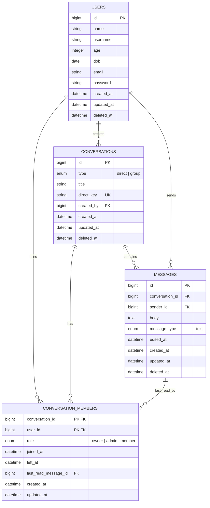

# Chat ER Diagram

## Notes

- `conversation_members` uses a composite primary key: `conversation_id + user_id`.
- `conversations.direct_key` is unique and is used to keep direct conversations idempotent.
- `messages.sender_id` is always the authenticated user who sent the message.
- `conversation_members.last_read_message_id` points to the last message read by that member.
